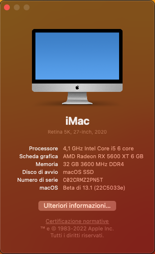
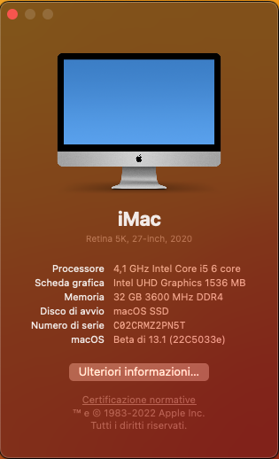
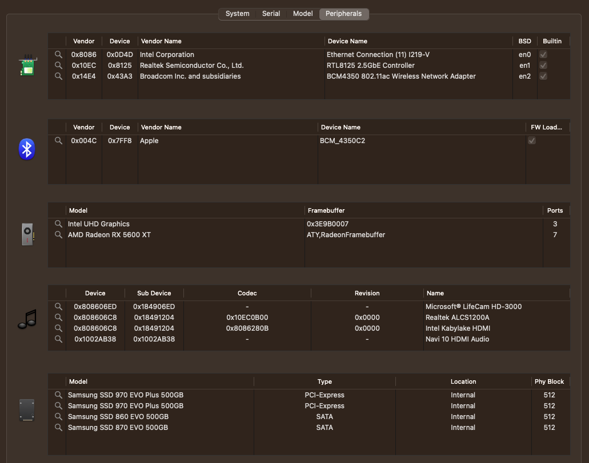
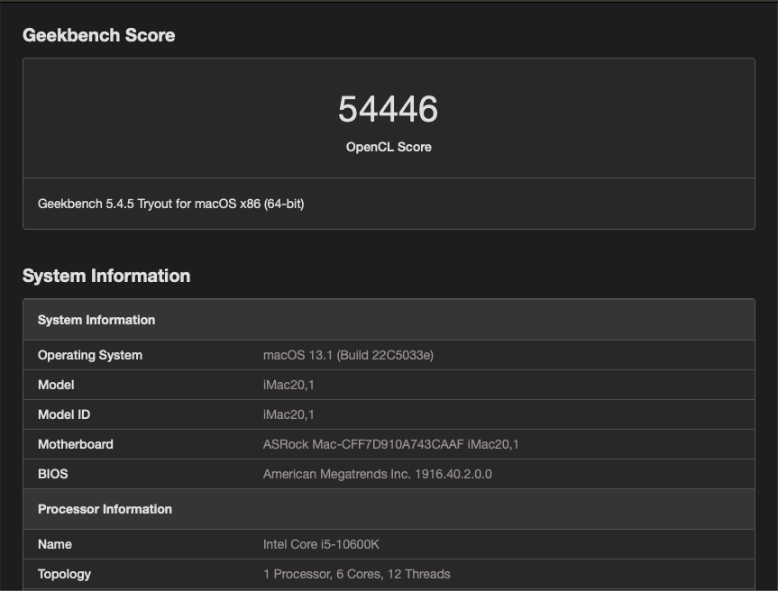
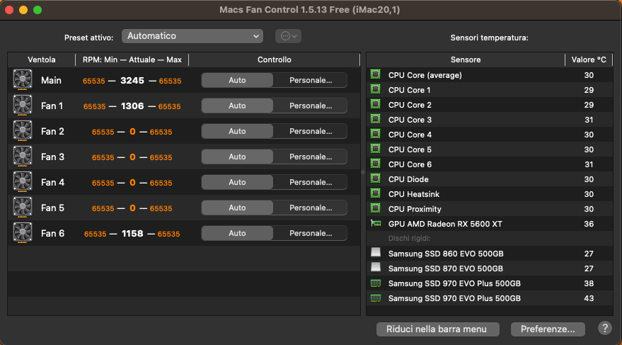
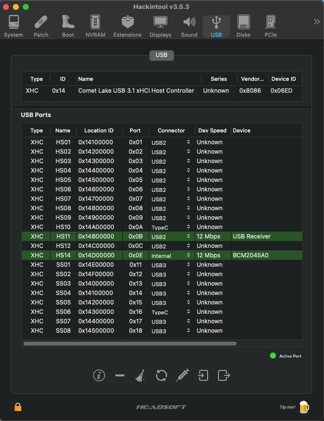

# ASROCK Z490M ITX/AC Hackintosh

EFI for ASROCK Z490M ITX/AC with OpenCore bootloader

### Computer Spec:

| Component        | Brank                              |
| ---------------- | ---------------------------------- |
| CPU              | Intel i5 10600K (6C-12T 12MB CML)  |
| iGPU             | Intel® UHD Graphics                |
| GPU              | SAPPHIRE PULSE RX5600XT 6GB GDDR6  |
| Lan 2.5 GBPS     | Realtek 8125                       |
| Lan 1.0 GBPS     | Intel I219 V11                     |
| Audio            | Realtek ALC1200                    |
| Ram              | CORSAIR 32GB DDR4 3600 MHz         |
| Wifi + Bluetooth | DW1820A (BCM94350ZAE)              |
| 1° NVMe SSD      | SAMSUNG 970 EVO PLUS 500 GB (MACOS)|
| 2° NVMe SSD      | SAMSUNG 970 EVO PLUS 500 GB (WIN)  |
| 1° SATA SSD      | SAMSUNG 860 EVO 500 GB (BACKUP)    |
| 2° SATA SSD      | SAMSUNG 870 EVO 500 GB (DATI)      |
| SmBios           | iMac 20,1                          |
| BootLoader       | OpenCore 0.8.5                     |
| macOS            | Ventura 13.1 Beta                  |

## Peripherals & Bench

## USB Port Map

### What works and What doesn't or WIP:

- [x] Intel UHD iGPU HDMI/DP Output
- [x] Intel UHD iGPU - H264 & HEVC
- [x] SAPPHIRE PULSE RX5600XT HDMI/DP OUTPUT (with audio) 
- [x] SAPPHIRE PULSE RX5600XT - H264 & HEVC
- [x] ALC1200 jack headphone (Front) 
- [x] ALC1200 jack line-out (Rear) 
- [x] ALC1200 jack microphone (Front & Rear)
- [x] ALC1200 jack linee-in (Rear) 
- [x] ALC1200 HDMI/DP Audio Output (IGPU)
- [x] All USB Ports (port mapping performed)
- [x] SpeedStep / Sleep / Wake
- [x] HID Key PWRB & SLPB 
- [x] Wi-Fi and Bluetooth DW1820A (BCM94350ZAE) Module
- [x] 1° CONTROLLER NVME PciE Gen3x4
- [x] 2° CONTROLLER NVME PciE Gen3x4
- [x] CONTROLLER SATA AHCI
- [x] All Sensors (CPU, GPU, NVME, SATA, FANS)
- [x] Realtek RTL8125 LAN
- [x] Intel I219 V11 LAN
- [x] NVRAM
- [x] Windows 11 boot from OpenCore
- [x] Linux boot from OpenCore

See [ioreg](./iMac_20,1.ioreg) for more clarification

### MacOS bootable USB creation:
- Read the Dortania guide for creating your USB from Windows or macOS
- [Guide Dortania](https://dortania.github.io/OpenCore-Install-Guide/installer-guide/) - USB creation

## Bios settings
### Enable :
* SATA Operation : AHCI
* XHCI Hand-Off
* XMP 2.0 Profile 1 or AUTO
* Primary Graphics Adapter : AUTO
* Share Memory : 128Mb
* IGPU Multi-Monitor

### Disable : 
* Secure Boot
* Intel SGX
* Fastboot
* CFG LOCK
* Boot From Onboard LAN
* CSM

## Credits

- [Apple](https://apple.com) for macOS;
- [Acidanthera](https://github.com/acidanthera) for OpenCore and all the lovely hackintosh work.
